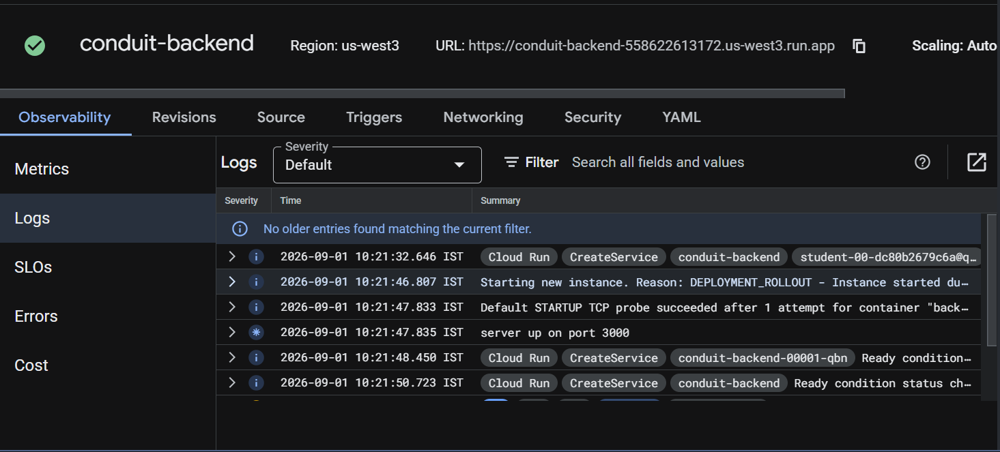

# Conduit Backend

Node.js, Express, Prisma, and PostgreSQL backend for the Conduit RealWorld application. It provides authentication, users, profiles, articles, comments, favorites, tags, and follows.

## Architecture

```text
React frontend on Cloud Run -> Express API on Cloud Run -> Neon PostgreSQL
```

The Docker image is stored in Google Artifact Registry and run by Cloud Run. Neon provides the managed PostgreSQL database.

## Prerequisites

- Node.js 20 and npm
- Git
- Neon PostgreSQL database
- Google Cloud CLI and Docker for deployment

## Environment variables

Create `Backend/.env` locally. Never commit it.

```env
DATABASE_URL="your_neon_connection_string"
JWT_SECRET="your_random_secret"
NODE_ENV=development
```

## Run locally

```bash
npm ci
npx prisma generate
npx prisma migrate deploy
npx nx serve api
```

The API runs on `http://localhost:3000`. Test it with:

```bash
curl http://localhost:3000/
```

Expected response:

```json
{"status":"API is running on /api"}
```

To add sample data:

```bash
npx prisma db seed
```

## Tests

```bash
npm test -- --runInBand
```

## Docker

From the Backend directory:

```bash
docker build -t conduit-backend:local .
docker run --name conduit-backend --env-file .env -p 3000:3000 conduit-backend:local
```

## Cloud Run deployment

```bash
export PROJECT_ID=$(gcloud config get-value project)
export REGION=us-east4
export IMAGE=$REGION-docker.pkg.dev/$PROJECT_ID/conduit/backend:v1.0.0

docker tag conduit-backend:local $IMAGE
docker push $IMAGE

gcloud run deploy conduit-backend \
  --image $IMAGE \
  --region $REGION \
  --port 3000 \
  --no-allow-unauthenticated
```

Configure `DATABASE_URL`, `JWT_SECRET`, and `NODE_ENV` in the Cloud Run service variables. Secrets are never stored in the Docker image.

## CI/CD

The workflow is `.github/workflows/ci-cd.yml`. On every push to `main`, GitHub Actions checks out the code, installs dependencies, runs tests, runs `npm audit`, builds and pushes a Docker image, and deploys it to Cloud Run.

Required GitHub secrets:

```text
GCP_PROJECT_ID
GCP_SA_KEY
DATABASE_URL
JWT_SECRET
```

## Versioning

Images use `v1.0.<GitHub run number>`, for example `backend:v1.0.12`, so every deployment has a unique version.

## Security

- Database credentials and JWT secrets are stored as GitHub and Cloud Run secrets.
- `.env` files and service-account JSON keys are excluded from Git.
- `npm audit --audit-level=high` checks dependencies during CI/CD.
- Cloud Run is private in the Qwiklabs environment because public IAM access is restricted.
- A production setup should use Workload Identity Federation and Secret Manager instead of long-lived service-account keys.

## Monitoring and observability

Cloud Run automatically sends request, container, and system logs to Cloud Logging. View them at:

```text
Google Cloud Console -> Cloud Run -> conduit-backend -> Logs
```

Request count, latency, CPU, memory, instances, and errors are available at:

```text
Google Cloud Console -> Cloud Run -> conduit-backend -> Metrics
```

## Challenges and solutions

- The frontend and backend were separate repositories, so the frontend API URL was made configurable.
- The original frontend uses an older React toolchain and requires Node.js 10 locally.
- Neon credentials are configured separately for local development, CI/CD, and Cloud Run.
- Qwiklabs restricted public Cloud Run IAM changes, so services were deployed privately for testing.

## Deployment and logs

The backend was deployed successfully to Google Cloud Run. The screenshot below shows the deployed service, its region and URL, and the Cloud Run startup logs.


